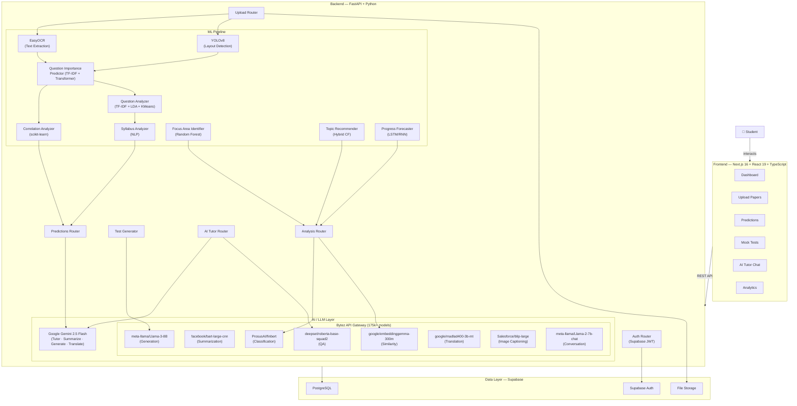

# PrepIQ — AI-Powered Exam Preparation Platform

> Predict exam questions. Generate smart mock tests. Learn with a Socratic AI tutor.


-blue?style=flat&logo=postgresql)


---

## What is PrepIQ?

PrepIQ analyzes your past exam papers using a pipeline of 11+ ML and NLP models to surface high-probability questions, generate personalized mock tests, and guide your revision with an AI tutor that teaches — not just answers.

Built for students who want to study smarter, not just harder.

---

## Full System Architecture


```mermaid
flowchart TD
    User["👤 Student"]

    subgraph Frontend["Frontend — Next.js 16 + React 19 + TypeScript"]
        UI_Dashboard["Dashboard"]
        UI_Upload["Upload Papers"]
        UI_Predictions["Predictions"]
        UI_Tests["Mock Tests"]
        UI_Tutor["AI Tutor Chat"]
        UI_Analytics["Analytics"]
    end

    subgraph Backend["Backend — FastAPI + Python"]
        Auth["Auth Router\n(Supabase JWT)"]
        UploadRouter["Upload Router"]
        PredictRouter["Predictions Router"]
        TestRouter["Test Generator"]
        ChatRouter["AI Tutor Router"]
        AnalysisRouter["Analysis Router"]

        subgraph MLPipeline["ML Pipeline"]
            OCR["EasyOCR\n(Text Extraction)"]
            Layout["YOLOv8\n(Layout Detection)"]
            QImportance["Question Importance\nPredictor (TF-IDF + Transformer)"]
            QAnalyzer["Question Analyzer\n(TF-IDF + LDA + KMeans)"]
            Correlation["Correlation Analyzer\n(scikit-learn)"]
            SyllabusMap["Syllabus Analyzer\n(NLP)"]
            FocusID["Focus Area Identifier\n(Random Forest)"]
            TopicRec["Topic Recommender\n(Hybrid CF)"]
            ProgressFc["Progress Forecaster\n(LSTM/RNN)"]
        end

        subgraph AILayer["AI / LLM Layer"]
            Gemini["Google Gemini 2.5 Flash\n(Tutor · Summarize · Generate · Translate)"]
            subgraph Bytez["Bytez API Gateway (175k+ models)"]
                RoBERTa["deepset/roberta-base-squad2\n(QA)"]
                BART["facebook/bart-large-cnn\n(Summarization)"]
                FinBERT["ProsusAI/finbert\n(Classification)"]
                Llama3["meta-llama/Llama-3-8B\n(Generation)"]
                EmbGemma["google/embeddinggemma-300m\n(Similarity)"]
                Madlad["google/madlad400-3b-mt\n(Translation)"]
                BLIP["Salesforce/blip-large\n(Image Captioning)"]
                Llama2["meta-llama/Llama-2-7b-chat\n(Conversation)"]
            end
        end
    end

    subgraph Data["Data Layer — Supabase"]
        PG["PostgreSQL"]
        SupaAuth["Supabase Auth"]
        Storage["File Storage"]
    end

    User -->|interacts| Frontend
    Frontend -->|REST API calls| Backend
    Auth --> SupaAuth
    UploadRouter --> OCR
    UploadRouter --> Layout
    UploadRouter --> Storage
    OCR --> QImportance
    Layout --> QImportance
    QImportance --> Correlation
    QImportance --> QAnalyzer
    QAnalyzer --> SyllabusMap
    Correlation --> PredictRouter
    SyllabusMap --> PredictRouter
    FocusID --> AnalysisRouter
    TopicRec --> AnalysisRouter
    ProgressFc --> AnalysisRouter
    PredictRouter --> Gemini
    ChatRouter --> Gemini
    ChatRouter --> RoBERTa
    TestRouter --> Llama3
    AnalysisRouter --> FinBERT
    AnalysisRouter --> EmbGemma
    Backend --> PG
```

---

## Features

- **Question Prediction** — ML pipeline analyzes historical papers to surface recurring patterns with confidence scores
- **Smart Mock Tests** — Generates practice tests weighted by prediction probability
- **AI Tutor** — Socratic chatbot powered by Gemini 2.5 Flash that guides you to answers without giving them away
- **Analytics Dashboard** — Visualizes weak areas, topic frequency, and revision progress
- **Subject Management** — Organize subjects, papers, and study plans in one place

---

## AI Models Used

### Google Gemini 2.5 Flash
| Task | Details |
|------|---------|
| AI Tutor | Socratic teaching persona — guides students without revealing answers |
| Summarization | Condenses study materials into concise notes |
| Text Generation | Creates mock questions and concept explanations |
| Translation | Translates study materials between languages |

### Bytez API (serverless model gateway)
| Model | Task |
|-------|------|
| deepset/roberta-base-squad2 | Question answering from document context |
| facebook/bart-large-cnn | Long-form text summarization |
| ProsusAI/finbert | Text classification and topic analysis |
| meta-llama/Llama-3-8B | Question and content generation |
| google/embeddinggemma-300m | Semantic similarity for duplicate detection |
| google/madlad400-3b-mt | Multi-language translation |
| Salesforce/blip-image-captioning-large | Image captioning for diagram extraction |
| meta-llama/Llama-2-7b-chat | Conversational AI interactions |

### Local ML Engines (Python)
| Engine | Task |
|--------|------|
| Question Importance Predictor (TF-IDF + Transformer) | Ranks questions by exam likelihood |
| Question Analyzer (TF-IDF + LDA + KMeans) | Topic modeling and clustering |
| Correlation Analyzer (scikit-learn) | Patterns in historical exam data |
| Syllabus Analyzer (NLP) | Maps syllabus topics to question bank |
| Focus Area Identifier (Random Forest) | Identifies student weak areas |
| Topic Recommender (Hybrid CF) | Personalized topic suggestions |
| Progress Forecaster (LSTM/RNN) | Predicts future learning progress |

---

## Tech Stack

| Layer | Technology |
|-------|------------|
| Frontend | Next.js 16, React 19, TypeScript, Tailwind CSS |
| Backend | FastAPI, Python, SQLAlchemy |
| Database | PostgreSQL via Supabase |
| Auth | Supabase Auth + JWT |
| AI / LLM | Google Gemini 2.5 Flash, Bytez API |
| ML / NLP | RoBERTa, YOLOv8, EasyOCR, scikit-learn, LSTM |

---

## API Endpoints

| Method | Endpoint | Description |
|--------|----------|-------------|
| POST | `/auth/signup` | User registration |
| POST | `/auth/login` | User login |
| GET | `/subjects` | List subjects |
| POST | `/upload/` | Upload question paper |
| GET | `/predictions/{id}/latest` | Get predictions with confidence scores |
| POST | `/tests/generate` | Generate weighted mock test |
| POST | `/chat/tutor` | AI tutor session |
| GET | `/wizard/status` | Setup wizard status |

---

## Project Structure

```
PrepIQ/
├── backend/
│   ├── app/
│   │   ├── routers/       # API route handlers
│   │   ├── services/      # Business logic + ML pipeline
│   │   ├── core/          # Config & security
│   │   ├── models.py      # Database models
│   │   ├── schemas.py     # Pydantic schemas
│   │   └── main.py        # FastAPI entry point
│   └── requirements.txt
│
└── frontend/
    ├── app/
    │   ├── page.tsx           # Landing page
    │   └── protected/         # Auth-gated routes
    │       ├── dashboard/
    │       ├── subjects/
    │       ├── predictions/
    │       ├── tests/
    │       ├── chat/
    │       └── upload/
    └── src/
        ├── components/
        ├── lib/               # API client + utilities
        └── hooks/
```

---

## Quick Start

```bash
# Backend
cd backend
pip install -r requirements.txt
cp .env.example .env
uvicorn app.main:app --reload

# Frontend
cd frontend
npm install
cp .env.example .env.local
npm run dev
```

### Environment Variables

**Backend `.env`**
```env
DATABASE_URL=postgresql://...
SUPABASE_URL=https://...
SUPABASE_SERVICE_KEY=...
JWT_SECRET=...
GEMINI_API_KEY=...
BYTEZ_API_KEY=...
```

**Frontend `.env.local`**
```env
NEXT_PUBLIC_API_URL=http://localhost:8000
NEXT_PUBLIC_SUPABASE_URL=https://...
NEXT_PUBLIC_SUPABASE_ANON_KEY=...
```

---

## Deployment

| Service | Platform |
|---------|----------|
| Frontend | Vercel |
| Backend | Railway |
| Database | Supabase |

---

## License

MIT © [Ashutosh Patra](https://github.com/Ashutosh3021)