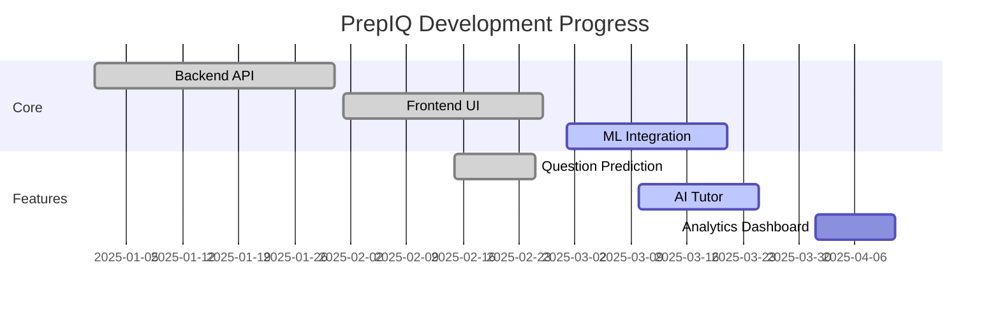

# 🚀 PrepIQ

> **AI-Powered Exam Preparation Platform**  
> Predict exam questions, generate smart tests, and learn with an AI tutor.


-blue?logo=postgresql)


---

## 📊 Project Status


```mermaid
gantt
    title PrepIQ Development Progress
    dateFormat  YYYY-MM-DD
    section Core
    Backend API           :done, 2025-01-01, 30d
    Frontend UI           :done, 2025-02-01, 25d
    ML Integration        :active, 2025-03-01, 20d
    section Features
    Question Prediction   :done, 2025-02-15, 10d
    AI Tutor              :active, 2025-03-10, 15d
    Analytics Dashboard   :pending, 2025-04-01, 10d
```

---

## 🎯 Tech Stack

| Layer | Technology |
|-------|------------|
| Frontend | Next.js 16, React 19, TypeScript, Tailwind CSS |
| Backend | FastAPI, Python, SQLAlchemy |
| Database | PostgreSQL (Supabase) |
| Auth | Supabase Auth, JWT |
| AI/ML | Google Gemini, Bytez API, Lightweight ML |

---

## ✨ Features

- 🧠 **Question Prediction** – AI analyzes past papers to predict likely exam questions  
- 📝 **Smart Mock Tests** – Generate practice tests from your uploaded materials  
- 🤖 **AI Tutor** – Socratic teaching chatbot that guides you to answers  
- 📈 **Analytics Dashboard** – Visualize patterns, trends, and weak areas  
- 📚 **Subject Management** – Organize subjects, papers, and study plans  

---

## 🖼️ Gallery (App Screenshots)

*Place your actual screenshots here – replace the placeholder images with your own.*


*Dashboard – overview of your progress*


*AI Tutor – Socratic learning in action*


*Question prediction results with confidence scores*

---

## 🧠 Meme of the Day (because debugging is hard)


> *“AI will take your exam… but only after you fix the environment variables.”*  
> – Every developer ever

---

## 🚀 Quick Start

```bash
# Backend
cd backend
pip install -r requirements.txt
cp .env.example .env  # Configure env vars
uvicorn app.main:app --reload

# Frontend  
cd frontend
npm install
cp .env.example .env.local
npm run dev
```

---

## 📁 Project Structure

```
PrepIQ/
├── backend/
│   ├── app/
│   │   ├── routers/       # API endpoints
│   │   │   ├── auth.py
│   │   │   ├── subjects.py
│   │   │   ├── predictions.py
│   │   │   ├── tests.py
│   │   │   ├── upload.py
│   │   │   ├── chat.py
│   │   │   ├── analysis.py
│   │   │   └── wizard.py
│   │   ├── services/      # Business logic
│   │   ├── core/          # Config & security
│   │   ├── models.py      # Database models
│   │   ├── schemas.py     # Pydantic schemas
│   │   └── main.py        # FastAPI app
│   └── requirements.txt
│
├── frontend/
│   ├── app/
│   │   ├── page.tsx           # Landing page
│   │   ├── login/
│   │   ├── signup/
│   │   ├── wizard/
│   │   ├── auth/callback/
│   │   └── protected/         # Protected routes
│   │       ├── layout.tsx
│   │       ├── dashboard/
│   │       ├── subjects/
│   │       ├── predictions/
│   │       ├── tests/
│   │       ├── chat/
│   │       ├── upload/
│   │       └── profile/
│   ├── src/
│   │   ├── components/     # React components
│   │   ├── lib/           # API client, utilities
│   │   └── hooks/         # Custom hooks
│   └── public/
│
├── .env                   # Environment config
├── .env.example          # Environment template
└── bugs.md              # Known issues
```

---

## 🔧 Environment Variables

### Backend (.env)
```env
DATABASE_URL=postgresql://...
SUPABASE_URL=https://...
SUPABASE_SERVICE_KEY=...
JWT_SECRET=...
GEMINI_API_KEY=...
BYTEZ_API_KEY=...
```

### Frontend (.env.local)
```env
NEXT_PUBLIC_API_URL=http://localhost:8000
NEXT_PUBLIC_SUPABASE_URL=https://...
NEXT_PUBLIC_SUPABASE_ANON_KEY=...
```

---

## 📡 API Endpoints

| Endpoint | Description |
|----------|-------------|
| `POST /auth/signup` | User registration |
| `POST /auth/login` | User login |
| `GET /subjects` | List subjects |
| `POST /subjects` | Create subject |
| `POST /upload/` | Upload question paper |
| `GET /predictions/{id}/latest` | Get predictions |
| `POST /tests/generate` | Generate mock test |
| `POST /chat/tutor` | AI tutor chat |
| `GET /wizard/status` | Setup wizard status |

---

## ☁️ Deployment

- **Frontend**: Vercel (push to `main`)  
- **Backend**: Render / Railway  
- **Database**: Supabase PostgreSQL  

---

## 📄 License

MIT © Ashutosh Patra

---

*Made with ❤️ for students who want to beat the exam stress.*